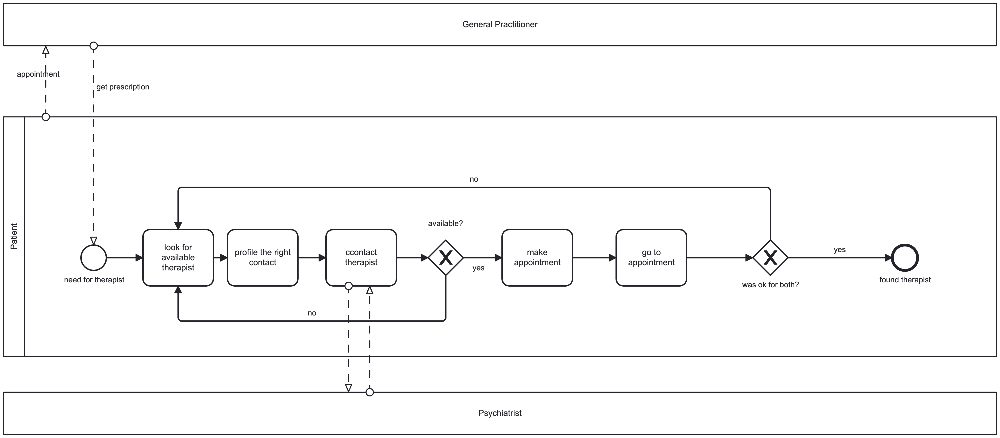

# Therapist Matcher / Find My Therapy

**Automation of Patient–Therapist Matching**

This project digitalizes and simplifies the process for patients seeking a fitting and available psychotherapist after receiving a prescription. By matching patients against professional criteria, availability, and individual needs, it reduces waiting times, increases transparency, and provides therapists with a clear digital interface to efficiently accept or decline new patients.

## Table of Contents

1. [Team Chocolat-Express](#1--team-chocolat-express--psychotherapist-matching-process)
2. [Introduction](#2--introduction)
3. [Challenges of the Current Process](#3--challenges-of-the-current-process)
4. [Goal and Vision](#4--goal-and-vision)
5. [Technologies Used](#5--technologies-used)
6. [AS-IS Process](#6--as-is-process)
7. [TO-BE Process](#7--to-be-process)
8. [BPMN Process Overview](#8--bpmn-process-overview)
9. [Technologies & Modules](#9--technologies--modules)
10. [Integrated Flow](#10--integrated-flow)
11. [Decision Model & Matching Logic](#11--decision-model--matching-logic)
    - [Overview](#overview)
    - [Key Features](#key-features)
12. [Process Improvements](#12--process-improvements)
13. [Operational Efficiency & Costs](#13--operational-efficiency--costs)
14. [Future Steps and Opportunities](#14--future-steps-and-opportunities)

---

## 1. 👥 Team Chocolat-Express – Psychotherapist Matching Process

### 🧑‍🔧 Team Members

| Name            | Email                                                                       |
| --------------- | --------------------------------------------------------------------------- |
| Jana Stojanovic | [jana.stojanovic@students.fhnw.ch](mailto:jana.stojanovic@students.fhnw.ch) |
| Christine Remy  | [christine.remya@students.fhnw.ch](mailto:christine.remya@students.fhnw.ch) |
| Daniel Fuhst    | [daniel.fuhst@students.fhnw.ch](mailto:daniel.fuhst@students.fhnw.ch)       |

### 💡 Coaches

- Andreas Martin
- Charuta Pande
- Devid Montecchiari

---

## 2. 📝 Introduction

Finding an available and suitable psychotherapist is often a long and frustrating process for patients. Current workflows rely heavily on manual coordination, phone calls, and fragmented information across institutions and practitioners. This project addresses these issues by introducing a **digitized, rule-based matching process** that supports decision-making while keeping human oversight in place.

The system focuses on **efficiency, transparency, and fairness**, ensuring that patients receive suitable therapist suggestions while therapists retain control over their capacity and case acceptance.

---

## 3. 🧩 Challenges of the Current Process

- High administrative burden for patients and providers
- Manual and repetitive data handling
- Limited transparency regarding therapist availability
- Long waiting times and inefficient follow-ups
- No standardized decision logic for matching

The main challenge was to define **relevant matching dimensions** (medical, logistical, and personal preferences) and implement them in a structured, automated decision-support tool.

---

## 4. 🎯 Goal and Vision

**Goal**

To optimize the patient–psychotherapist matching process by implementing a digitized, rule-based workflow that supports faster and more reliable matching.

**Vision**

To provide patients with an easy-to-use platform delivering confident and transparent therapist suggestions, while enabling therapists to manage requests digitally and efficiently.

---

## 5. 🧑‍💻 Technologies Used

| Component    | Purpose                              |
| ------------ | ------------------------------------ |
| Camunda 7    | Business process orchestration       |
| BPMN 2.0     | Process modeling language            |
| DMN 1.3      | Decision modeling notation           |
| Google Forms | Patient data intake                  |
| Deepnote     | API integration & ML experimentation |
| Flask        | REST API server                      |
| Python       | Backend processing & ML model        |
| scikit-learn | Machine learning (Logistic Regression) |

---

## 6. 📦 AS-IS Process

### Description

The current (AS-IS) process is largely manual and fragmented. Patients typically contact multiple therapists individually, often without knowing availability or specialization fit in advance.



### Roles Involved

**Internal**

- Administrative staff
- Coordination services

**External**

- Patients seeking therapy
- Licensed psychotherapists

### 📋 Summarized AS-IS Process

| Step | Description               | Comments                                    | Lane    |
| ---- | ------------------------- | ------------------------------------------- | ------- |
| 1    | Start: Request            | Patient initiates search for therapy        | Patient |
| 2    | Form Filling / Phone Call | Information provided manually               | Patient |
| 3    | Manual Matching           | Staff checks therapist fit and availability | Admin   |
| 4    | Feedback Loop             | Calls/emails until a therapist responds     | All     |

---

## 7. ✨ TO-BE Process

The TO-BE process introduces automation and structured decision logic while maintaining transparency and control for all parties.

### Key Features

- Digital intake via form or service hotline
- Rule-based decision table for therapist matching
- Automated communication via APIs
- Clear acceptance/decline workflow for therapists
- Reduced administrative workload


[Camunda BPMN](Appendix_README/TO_BE_PROCESS.bpmn)

---

## 8. 📌 BPMN Process Overview

The BPMN model includes:

- **Start Event**: Patient Request
- **User Tasks**: Form Input, Patient Confirmation, Therapist Decision
- **Business Rule Tasks**: Decision Tables (DMN)
- **Service Tasks**: API Communication with Deepnote
- **Gateways**: Decision points for confirmation/rejection
- **End Events**: Match confirmed or Re-run matching

### Process Flow

1. Patient submits preferences via form
2. Data is validated and preprocessed
3. Decision tables evaluate matching criteria
4. System suggests best-matching therapist
5. Patient confirms or declines suggestion
6. Therapist accepts or rejects request
7. Process ends with confirmation or loops back for new match

---

## 9. 🧾 Technologies & Modules

### Modules Used

| Module             | Purpose              | Description                                                      |
| ------------------ | -------------------- | ---------------------------------------------------------------- |
| Camunda Form       | Feature Input        | User Form to provide preferences                                 |
| HTTP Connector     | Deepnote Integration | Sends data to Deepnote via REST-API with GET, POST gateways     |
| Deepnote           | API Gateways         | Providing API-Gateways for GET, POST-Routes for client and therapist |

### Endpoints

**Camunda REST Endpoint**

```
/engine-rest/process-definition/key/Process_0ad1ggy/tenant-id/mi25chocolat/start
```

**Deepnote Notebooks**

- [API Server Notebook](https://deepnote.com/workspace/DHP25-244a274b-59d3-442f-b7ef-3d5d24503cee/project/chocolatexpress-fbdcce36-fd51-4cfb-8676-e6e544158098/notebook/APIServer-cc5e3854092d45b89dd08990f5fce491?secondary-sidebar-autoopen=true&secondary-sidebar=agent) - Flask REST API for appointment scheduling
- [ML Matcher Notebook](https://deepnote.com/workspace/DHP25-244a274b-59d3-442f-b7ef-3d5d24503cee/project/chocolatexpress-fbdcce36-fd51-4cfb-8676-e6e544158098/notebook/Logistic-Classification-Machine-Learning-Matcher-738d2ebcd5ce4bdba232b837d817c7f9?secondary-sidebar-autoopen=true&secondary-sidebar=agent) - ML-based external service task worker

---

## 10. 🔁 Integrated Flow

1. A person searches for a suitable therapist
2. The person either calls a service number or fills out a digital form
3. Form variables are sent to a preprocessing decision table
   - Variables are mapped to integer-based categories
   - Each category contributes to the final matching logic
4. A decision table determines a matching `therapist_id`
5. The matching result is returned via API
6. The patient confirms or declines the suggestion
7. The therapist is informed and can accept or reject the request
8. The process ends with confirmation or re-matching

---

## 11. 🧮 Decision Model & Matching Logic

The matching system uses a multi-layered decision model that normalizes patient preferences and therapist attributes into discrete categories, enabling deterministic and transparent matching logic.

### Overview

- **Input Variables**: Patient preferences (therapy setting, disease category, weekday, daytime, gender, waiting time)
- **Normalization**: All variables are mapped to integer-based categories
- **Decision Layers**: Multiple focused decisions produce intermediate variables
- **Final Selection**: Rule-based decision table selects the most suitable therapist
- **Hit Policy**: `COLLECT (MAX)` for deterministic, explainable results

### Key Features

- Full transparency for stakeholders
- Easy validation by domain experts
- Legally and ethically explainable
- Low data requirement
- Migration path to ML models (Logistic Regression → XGBoost)

For detailed information about the decision model, matching logic, input/output variables, and decision layers, see:

📄 **[Decision Table Documentation](Appendix_README/Decision%20Table.md)**

---

## 12. 🚀 Process Improvements

| Challenge                | Solution                              |
| ------------------------ | ------------------------------------- |
| Manual data collection   | Google Forms with automated triggers  |
| Fragmented communication | Centralized BPMN process              |
| Slow matching decisions  | Decision tables with rule-based logic |
| Lack of transparency     | Structured process & digital tracking |

The improved process significantly reduces delays, errors, and manual workload while improving the overall user experience.

---

## 13. ⚙️ Operational Efficiency & Costs

- Reduced administrative effort
- Faster patient placement
- Better utilization of therapist capacity
- Scalable integration with existing IT infrastructures

---

## 14. 🔮 Future Steps and Opportunities

### Process Enhancements

- Direct therapist self-service portal for availability updates
- Automated synchronization of vacation and capacity data
- Patient and therapist feedback loops

### Future Outlook

With increasing data availability, the rule-based decision table could be replaced or augmented by **machine learning model**:

- Logistic Regression (transparent, small data friendly)

The system could generate a **Top-3 matching score** instead of a single result: note that the Deepnote-code is only running in deepnote and is not connected to a possible future process. You´ll see
matching results directly in the notebook terminal.

[Logistic Regression Documentation](deepnote/Logistic%20Regression%20Matcher.md)


